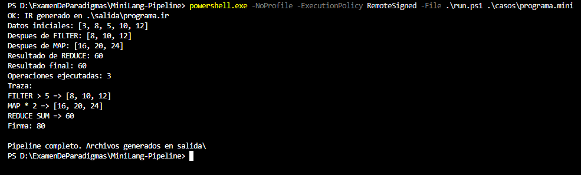

# Caso 1: programa válido completo

**Propósito.** Comprobar que las tres etapas se comunican mediante archivos y procesan FILTER, MAP, REDUCE y PRINT en orden.

**Archivo de entrada:** [casos/programa.mini](../casos/programa.mini)

~~~text
DATA 3 8 5 10 12
FILTER > 5
MAP * 2
REDUCE SUM
PRINT
~~~

**Ejecución desde la raíz del proyecto:**

~~~powershell
powershell.exe -NoProfile -ExecutionPolicy RemoteSigned -File .\run.ps1 .\casos\programa.mini
~~~

**Resultado esperado.** Java genera programa.ir; Python comienza con [3, 8, 5, 10, 12], filtra los mayores que 5 y obtiene [8, 10, 12]; luego multiplica por 2 para obtener [16, 20, 24]. REDUCE SUM produce 60. Se ejecutan tres operaciones: FILTER, MAP y REDUCE. MIPS calcula (60 XOR 3) + 17 = 80.

**Resultado observado.** La traza mostró esas tres transformaciones, resultado 60, tres operaciones y “Firma: 80”. El pipeline terminó correctamente y creó los tres archivos en salida/.

**Captura.**

