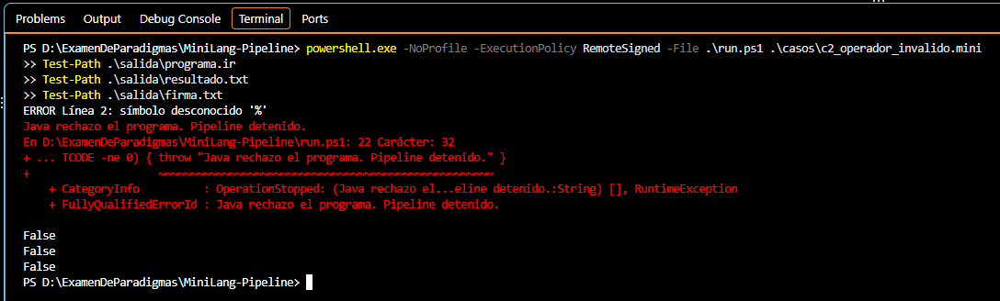

# Caso 2: operador inválido

**Propósito.** Verificar que Java detecte un símbolo que no pertenece a los comparadores de MiniLang y detenga el pipeline antes de Python y MIPS.

**Archivo de entrada:** [casos/c2_operador_invalido.mini](../casos/c2_operador_invalido.mini)

~~~text
DATA 3 8 5 10 12
FILTER % 5
MAP * 2
REDUCE SUM
PRINT
~~~

**Ejecución desde la raíz del proyecto:**

~~~powershell
powershell.exe -NoProfile -ExecutionPolicy RemoteSigned -File .\run.ps1 .\casos\c2_operador_invalido.mini
~~~

**Resultado esperado.** El símbolo % de la línea 2 no es un comparador permitido. Java debe informar el número de línea y no generar una nueva representación intermedia. El script detiene las etapas siguientes y elimina las salidas de la ejecución anterior.

**Resultado observado.** Java mostró “ERROR Línea 2: símbolo desconocido '%'”. run.ps1 mostró “Java rechazo el programa. Pipeline detenido.” Después se verificó que programa.ir, resultado.txt y firma.txt no existían.

**Captura.**

~~~powershell
Test-Path .\salida\programa.ir
Test-Path .\salida\resultado.txt
Test-Path .\salida\firma.txt
~~~

