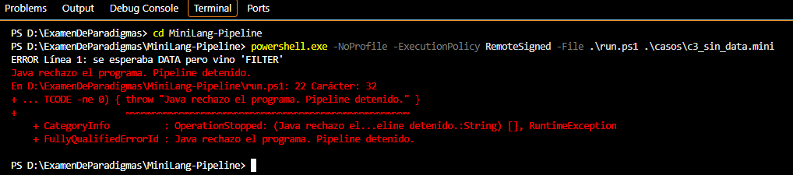

# Caso 3: programa sin DATA

**Propósito.** Comprobar que la entrada debe iniciar con DATA y que Java informe dónde se incumple la gramática.

**Archivo de entrada:** [casos/c3_sin_data.mini](../casos/c3_sin_data.mini)

~~~text
FILTER > 5
MAP * 2
REDUCE SUM
PRINT
~~~

**Ejecución desde la raíz del proyecto:**

~~~powershell
powershell.exe -NoProfile -ExecutionPolicy RemoteSigned -File .\run.ps1 .\casos\c3_sin_data.mini
~~~

**Resultado esperado.** El parser espera DATA como primera instrucción. Debe rechazar FILTER en la línea 1; el script no ejecuta Python ni MIPS.

**Resultado observado.** Java mostró “ERROR Línea 1: se esperaba DATA pero vino 'FILTER'” y run.ps1 indicó que el pipeline se detuvo.

**Captura.**

