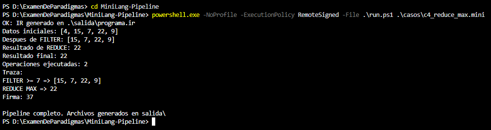

# Caso 4: REDUCE MAX

**Propósito.** Comprobar que Python seleccione el máximo de la lista después de FILTER y que MIPS utilice ese resultado.

**Archivo de entrada:** [casos/c4_reduce_max.mini](../casos/c4_reduce_max.mini)

~~~text
DATA 4 15 7 22 9
FILTER >= 7
REDUCE MAX
PRINT
~~~

**Ejecución desde la raíz del proyecto:**

~~~powershell
powershell.exe -NoProfile -ExecutionPolicy RemoteSigned -File .\run.ps1 .\casos\c4_reduce_max.mini
~~~

**Resultado esperado.** FILTER >= 7 deja [15, 7, 22, 9]; REDUCE MAX devuelve 22. Se cuentan dos operaciones. MIPS calcula (22 XOR 2) + 17 = 37.

**Resultado observado.** La traza mostró [15, 7, 22, 9], resultado 22, dos operaciones y firma 37.

**Captura.**

