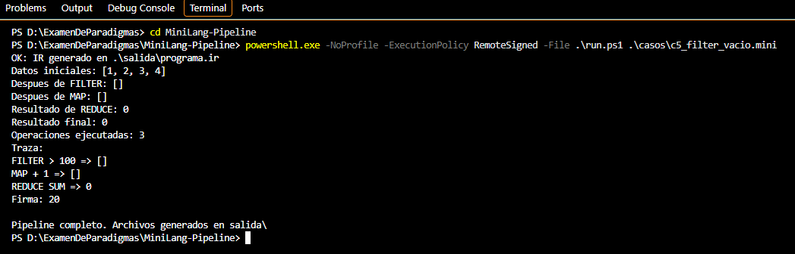

# Caso 5: FILTER deja la lista vacía

**Propósito.** Comprobar que FILTER y MAP admitan una lista vacía y que REDUCE SUM tenga un resultado definido para ese caso.

**Archivo de entrada:** [casos/c5_filter_vacio.mini](../casos/c5_filter_vacio.mini)

~~~text
DATA 1 2 3 4
FILTER > 100
MAP + 1
REDUCE SUM
PRINT
~~~

**Ejecución desde la raíz del proyecto:**

~~~powershell
powershell.exe -NoProfile -ExecutionPolicy RemoteSigned -File .\run.ps1 .\casos\c5_filter_vacio.mini
~~~

**Resultado esperado.** Ningún elemento supera 100, por lo que FILTER devuelve []. MAP conserva []. REDUCE SUM usa el valor inicial 0 y devuelve 0. Se cuentan tres operaciones. MIPS calcula (0 XOR 3) + 17 = 20.

**Resultado observado.** La traza mostró [], [], resultado 0, tres operaciones y firma 20. El pipeline terminó correctamente.

**Captura.**

