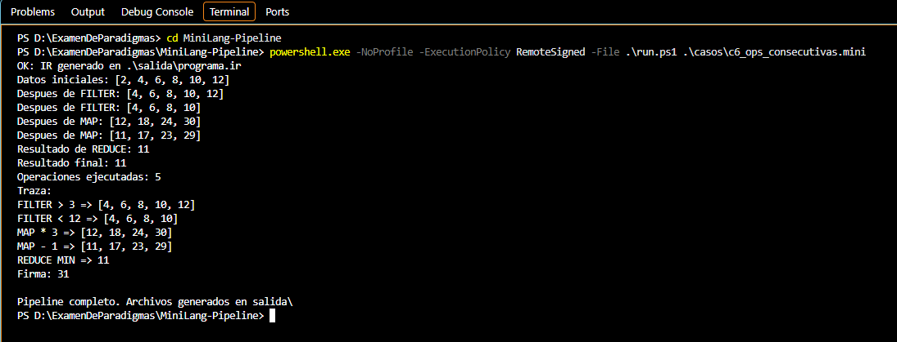

# Caso 6: FILTER y MAP consecutivos

**Propósito.** Verificar que Python aplique en orden dos FILTER y dos MAP sin perder el resultado intermedio.

**Archivo de entrada:** [casos/c6_ops_consecutivas.mini](../casos/c6_ops_consecutivas.mini)

~~~text
DATA 2 4 6 8 10 12
FILTER > 3
FILTER < 12
MAP * 3
MAP - 1
REDUCE MIN
PRINT
~~~

**Ejecución desde la raíz del proyecto:**

~~~powershell
powershell.exe -NoProfile -ExecutionPolicy RemoteSigned -File .\run.ps1 .\casos\c6_ops_consecutivas.mini
~~~

**Resultado esperado.**

| Paso | Lista o resultado |
| --- | --- |
| FILTER > 3 | [4, 6, 8, 10, 12] |
| FILTER < 12 | [4, 6, 8, 10] |
| MAP * 3 | [12, 18, 24, 30] |
| MAP - 1 | [11, 17, 23, 29] |
| REDUCE MIN | 11 |

Son cinco operaciones; MIPS calcula (11 XOR 5) + 17 = 31.

**Resultado observado.** La traza coincidió con los cinco pasos; el resultado fue 11 y la firma 31.

**Captura.**

