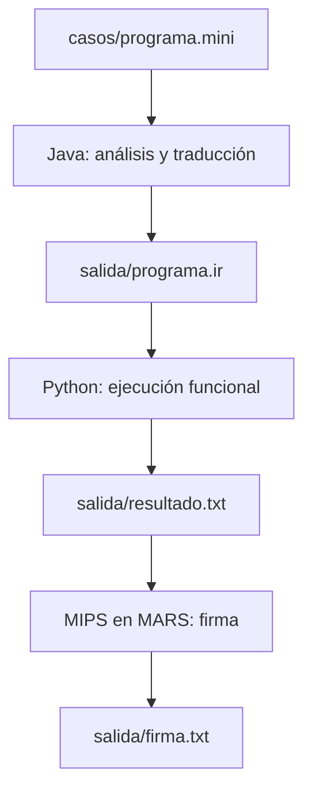

# MiniLang Pipeline

Proyecto de la Parte B del examen de Paradigmas de Programación. Procesa un archivo MiniLang en tres etapas: Java valida y genera una representación intermedia, Python ejecuta las transformaciones y MIPS calcula una firma de verificación.

## Requisitos

- Windows con PowerShell.
- JDK instalado (`javac` y `java` disponibles en la terminal).
- Python 3 disponible con el comando `python`.
- MARS en `tools/Mars4_5.jar`.

Ejecutar los comandos desde la raíz `MiniLang-Pipeline`.

## Ejecución

```powershell
powershell.exe -NoProfile -ExecutionPolicy RemoteSigned -File .\run.ps1 .\casos\programa.mini
```

Para ejecutar otro caso, sustituir la ruta del último argumento; por ejemplo:

```powershell
powershell.exe -NoProfile -ExecutionPolicy RemoteSigned -File .\run.ps1 .\casos\c4_reduce_max.mini
```

El script crea los directorios necesarios, compila Java, borra las salidas de la ejecución anterior y ejecuta Java, Python y MIPS en ese orden. Si una etapa falla, detiene el pipeline. Al terminar correctamente, los archivos generados están en `salida/`.

## Flujo y contratos de archivos



| Archivo | Formato usado | Responsable |
| --- | --- | --- |
| `casos/*.mini` | Una instrucción por línea. Comienza con `DATA`, continúa con una o más operaciones `FILTER`, `MAP` o `REDUCE`, y termina en `PRINT`. | Entrada |
| `salida/programa.ir` | Una instrucción por línea, separada por `|` cuando tiene argumentos; por ejemplo `DATA|3,8,5,10,12` y `FILTER|>|5`. | Java → Python |
| `salida/resultado.txt` | Línea 1: entero para la firma. Línea 2: cantidad de operaciones. Después: traza, `RESULT=...` y `OPS=...`. | Python → MIPS |
| `salida/firma.txt` | Un entero decimal y un salto de línea. | MIPS |

Java valida la sintaxis y muestra el número de línea cuando encuentra errores. En Java, las clases de instrucciones convierten cada instrucción válida a IR mediante su método correspondiente. Python usa `filter()`, `map()` y `reduce()` para ejecutar las transformaciones. La cantidad de operaciones cuenta cada `FILTER`, `MAP` y `REDUCE`; no cuenta `DATA` ni `PRINT`.

Cuando se ejecuta `REDUCE`, se obtiene un entero. Si después aparece otra operación, esta procesa el entero como una lista de un elemento. Si el resultado final es una lista, `RESULT` conserva esa lista y el primer número de `resultado.txt` es su suma; si es un entero, se usa ese entero directamente. Así MIPS siempre recibe un número derivado del resultado. Por ejemplo, `[2, 3, 4]` aporta `9` para la firma. `REDUCE SUM` de una lista vacía produce `0`; `MAX` y `MIN` de una lista vacía se rechazan en Python.

MIPS lee los dos primeros números de `resultado.txt` y calcula:

```text
firma = (numero_del_resultado XOR cantidad_de_operaciones) + 17
```

Para el caso principal: `(60 XOR 3) + 17 = 80`.

## Casos de prueba

| Caso | Archivo | Comportamiento esperado y observado |
| --- | --- | --- |
| 1. Programa completo | `casos/programa.mini` | Resultado `60`, 3 operaciones, firma `80`. |
| 2. Operador inválido | `casos/c2_operador_invalido.mini` | Java indica el error en la línea 2; el pipeline se detiene y no deja salidas de la ejecución anterior. |
| 3. Falta `DATA` | `casos/c3_sin_data.mini` | Java indica el error en la línea 1; el pipeline se detiene. |
| 4. `REDUCE MAX` | `casos/c4_reduce_max.mini` | Resultado `22`, 2 operaciones, firma `37`. |
| 5. Filtro vacío | `casos/c5_filter_vacio.mini` | Resultado `0`, 3 operaciones, firma `20`. |
| 6. Operaciones consecutivas | `casos/c6_ops_consecutivas.mini` | Resultado `11`, 5 operaciones, firma `31`. |

Se pueden ver los casos de prueba con mas detalle en la carpeta Casos de prueba. También se puede probar una secuencia sin `REDUCE`, por ejemplo `DATA 1 2 3`, `MAP + 1`, `PRINT`: resultado `[2, 3, 4]`, valor numérico `9`, 1 operación y firma `25`.

Una operación después de `REDUCE` también funciona: `DATA 1 2`, `REDUCE SUM`, `MAP + 1`, `PRINT` produce `[4]`, 2 operaciones y firma `23`.

Para las tres salidas generadas por una ejecución real, ejecutar al final el programa principal y comprobar:

```powershell
Get-Content .\salida\programa.ir
Get-Content .\salida\resultado.txt
Get-Content .\salida\firma.txt
```

